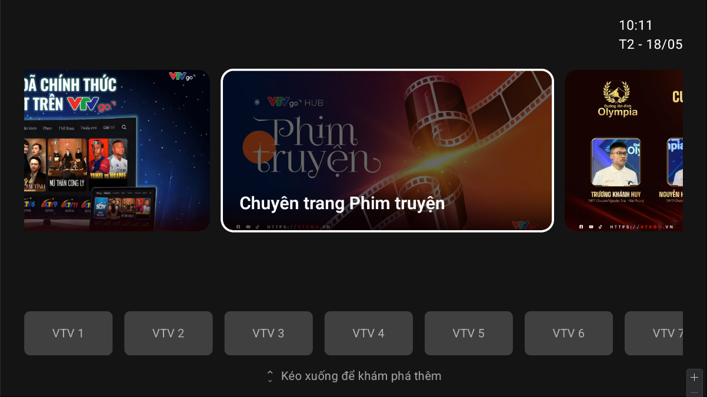
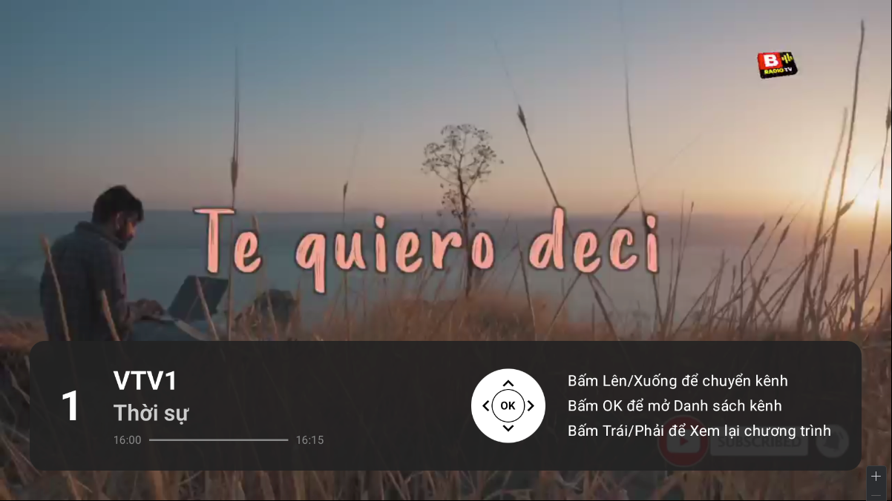
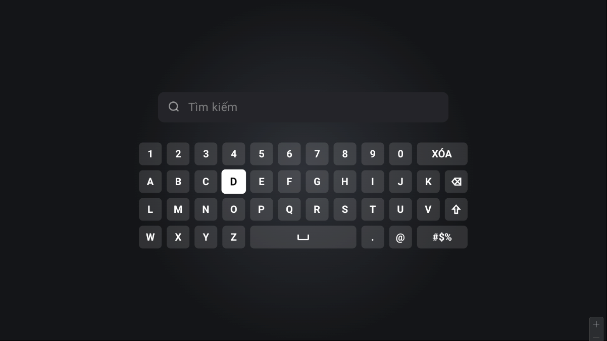
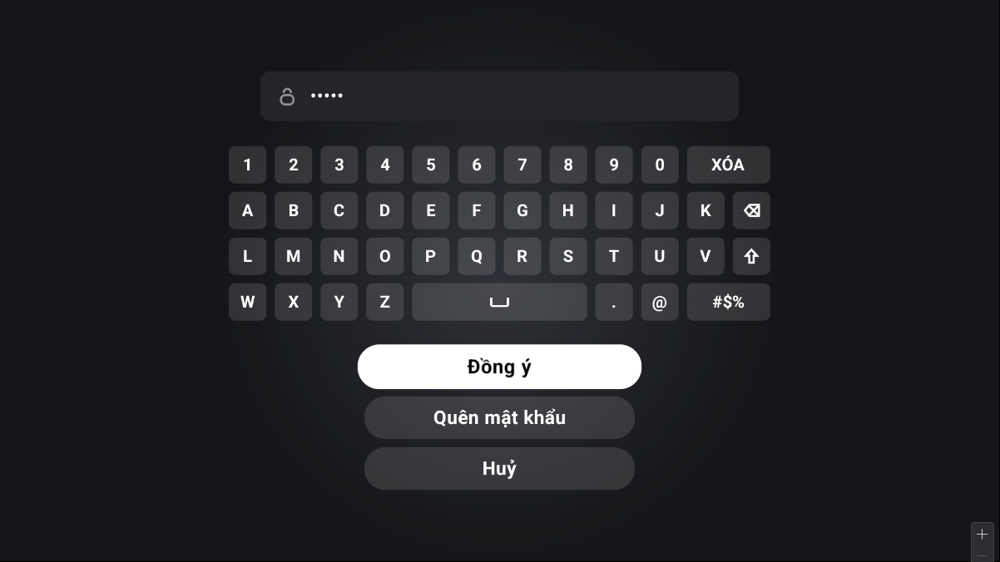
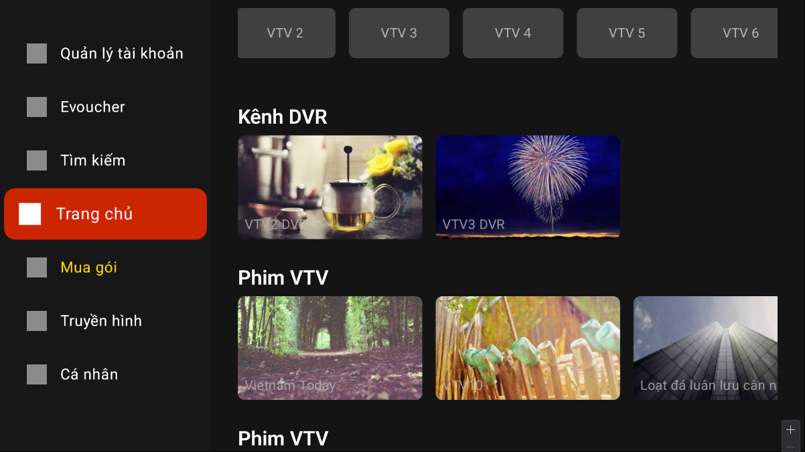
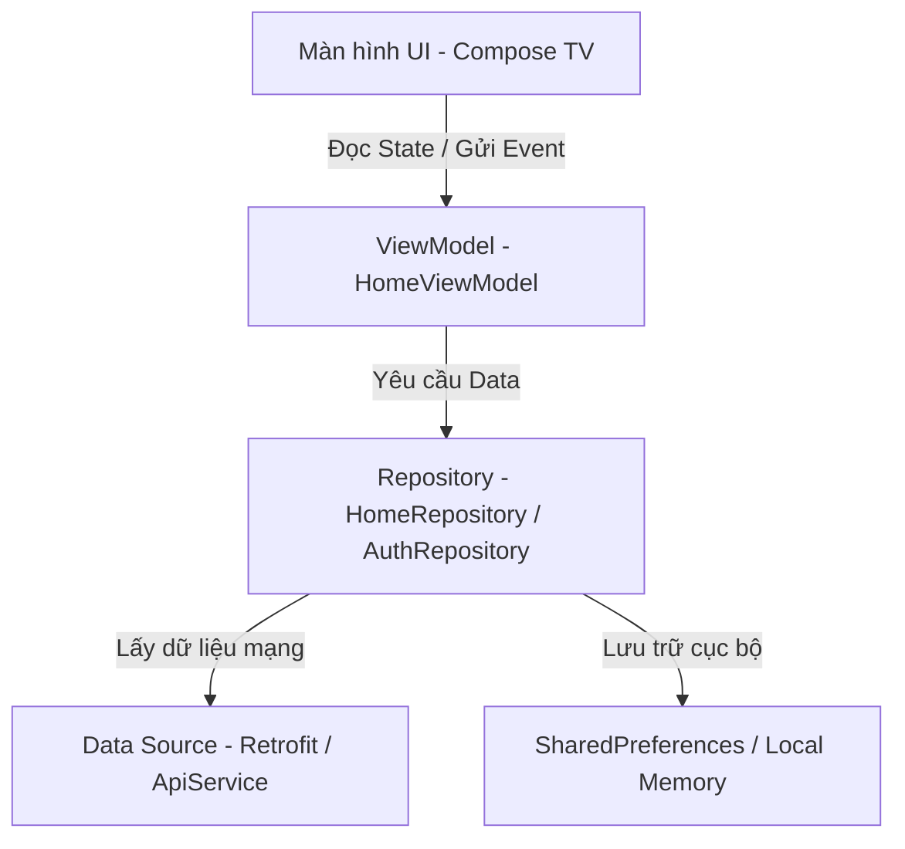
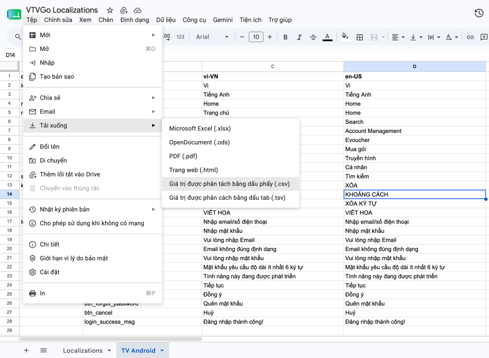
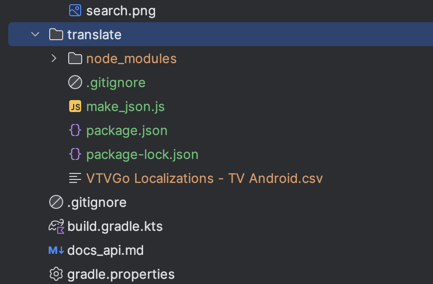

# 📺 Android TV Compose Demo Application (VTV Go TV)

Chào mừng bạn đến với dự án **VTV Go TV** (`vn.vtv.vtvgotv`) - Ứng dụng giải trí truyền hình chuyên nghiệp dành riêng cho nền tảng **Android TV / Smart TV**, được phát triển 100% bằng **Jetpack Compose for TV (Compose Material3 & TV Foundation)**.

---

## 📸 Hình ảnh Demo ứng dụng

> *Dưới đây là một số ảnh chụp thực tế màn hình giao diện demo ứng dụng trên Android TV:*

|               Màn hình Trang Chủ (Home Dashboard)               |                        Màn hình Player                        |                Màn hình Tìm Kiếm (TV Keyboard)                |           Màn hình Đăng Nhập (Account Login Flow)           |
|:---------------------------------------------------------------:|:-------------------------------------------------------------:|:-------------------------------------------------------------:|:-----------------------------------------------------------:|
|   |  |  |  |
|  |                                                               |                                                               |                                                             |

---

## 🛠️ Công nghệ & Kiến trúc dự án

Dự án áp dụng mô hình kiến trúc chuẩn mực **Clean Architecture** kết hợp mô hình **MVVM (Model-View-ViewModel)** để phân tách luồng dữ liệu, nâng cao khả năng bảo trì và viết Unit Test.



### 1. Kiến trúc Clean Architecture trong từng Feature
Mỗi chức năng (như `auth`, `home`, `player`, `search`) được tổ chức thành cấu trúc 3 tầng độc lập tuyệt đối:
* **`domain`**: Chứa các thực thể dữ liệu sạch (`model`) và giao diện kết nối nghiệp vụ (`Repository` interface).
* **`data`**: Thực thi các repository interface, quản lý giao tiếp nguồn dữ liệu mạng (`remote/api`) hoặc lưu trữ nội bộ (`local`), thực hiện ánh xạ DTO sang Domain Model (Data Mapper Pattern).
* **`presentation`**: Quản lý UI States, các ViewModels điều phối luồng dữ liệu, các view chính (Screens) và các widget thành phần nhỏ (`composables`).

### 2. Feature-based Navigation Routing (Hệ thống điều hướng phi tập trung)
Để loại bỏ sự phình to của tệp tin cấu hình điều hướng trung tâm và đảm bảo tính độc lập tối đa:
* Mỗi feature tự định nghĩa và xuất khẩu (export) luồng điều hướng của riêng mình thông qua các hàm mở rộng (`extension functions`) trên `NavGraphBuilder`:
  * `fun NavGraphBuilder.authGraph(navController: NavController)`
  * `fun NavGraphBuilder.searchGraph(navController: NavController)`
  * `fun NavGraphBuilder.playerGraph(navController: NavController)`
* [AppNavigation.kt](file:///Users/bacngoduc/Documents/VTV/demo/DemoTVCompose/app/src/main/java/vn/vtv/vtvgotv/navigation/AppNavigation.kt) trung tâm đóng vai trò làm bộ điều phối tối giản, chỉ gọi tích hợp các luồng này.
* **CompositionLocal (`LocalNavController`)**: Khởi tạo và cung cấp `NavController` toàn cục xuyên suốt Compose Tree, triệt tiêu hoàn toàn hiện tượng **Prop Drilling**.

### 3. Modular Dependency Injection (DI) với Koin
Dự án chia nhỏ cấu hình DI tương ứng với từng module tính năng nhằm đảm bảo tính đóng gói:
* **`coreModule`**: Định nghĩa và cấu hình Network Client dùng chung toàn ứng dụng (OkHttpClient, Retrofit, Interceptors).
* **`authModule`**, **`homeModule`**, **`playerModule`**, **`searchModule`**: Mỗi feature tự đăng ký dịch vụ ApiService, DataSource, Repository và ViewModel độc lập.
* **`appModule`**: Tổng hợp các module con thành một danh sách hợp nhất cung cấp cho Koin lúc khởi chạy ứng dụng.

### 4. Jetpack Compose TV Elements
* **Theme, Design system (`core/theme`)**: Cấu hình bảng màu mở rộng hỗ trợ đồng thời Dark/Light Mode dành riêng cho TV, tối ưu hóa độ tương phản.
* **Canvas Drawing (Zero-Dependency Custom Icons)**: Tự vẽ các icon vector tối ưu hiệu năng vẽ tĩnh trên Smart TV (Lock, User, Backspace, Success Checkmark).
* **Side Effects & State Management**: Tận dụng `remember { mutableStateOf(...) }` cho biến giao diện tức thì, `derivedStateOf` để lọc trạng thái cuộn tối ưu hóa hiệu năng vẽ lại, và `LaunchedEffect` để kiểm soát các tác vụ song song bất đồng bộ.

---

## 📂 Cấu trúc mã nguồn chính

```text
app/src/main/java/vn/vtv/vtvgotv/
│
├── core/                  # Tầng lõi dùng chung (Core Layer)
│   ├── theme/             # Cấu hình Theme, Color, Typography cho TV
│   ├── network/           # Cấu hình OkHttpClient, Retrofit, Interceptors
│   ├── di/                # Koin Core Injection Module (coreModule)
│   └── utils/             # Các Extension hữu ích & DateTimeFormatter
│
├── features/              # Tầng tính năng (Feature Layer - Clean Architecture)
│   ├── auth/              # Tính năng Đăng nhập & Xác thực 2 bước
│   ├── home/              # Tính năng Trang chủ (Carousel, Channels, DVR)
│   ├── player/            # Tính năng Trình phát Video (Media3 ExoPlayer)
│   └── search/            # Tính năng Tìm kiếm & Custom TV Keyboard
│
├── navigation/            # Định tuyến Điều hướng (AppNavigation, Screen)
│
└── di/                    # AppModule tổng hợp các Koin DI Modules
```

---

## 🚀 Cách chạy dự án

1. Clone dự án về máy tính của bạn.
2. Mở dự án bằng **Android Studio** (phiên bản Ladybug trở lên khuyến nghị).
3. Đảm bảo bạn đã cài đặt Android SDK phù hợp.
4. Chạy lệnh Gradle sau để kiểm tra và biên dịch dự án:
   ```bash
   ./gradlew compileDebugKotlin
   ```
5. Nhấn **Run** để khởi chạy ứng dụng trực tiếp trên Android TV Emulator hoặc thiết bị Android TV thực tế.


## Translate

Thêm nội dung text vào [file](https://docs.google.com/spreadsheets/d/1KpUBKPOnH1SmlTaHqmMKcwK-fUSZ_Eofsuh48buadhM/edit?usp=sharing) và lưu file dạng csv vào folder translate như này:

|   |  |


Sau đó gõ `cd translate && node make_json.js`
